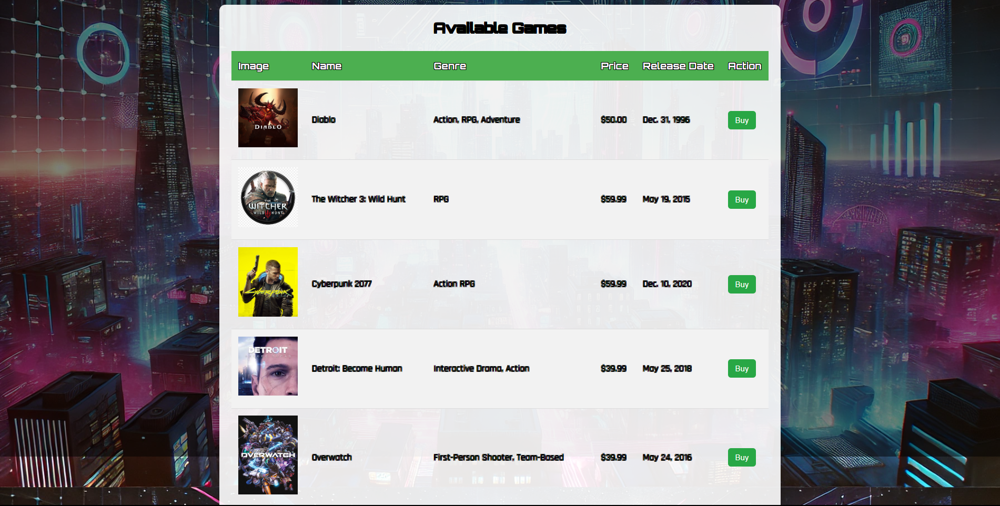
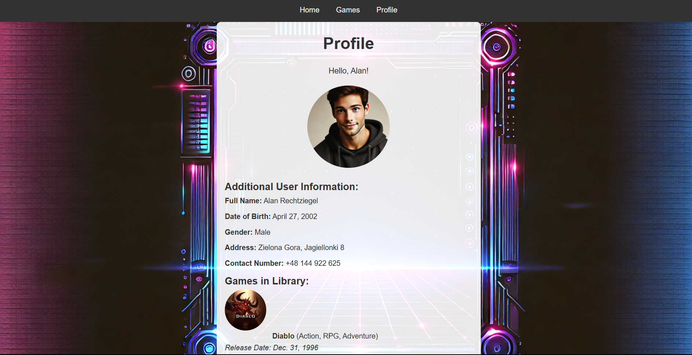
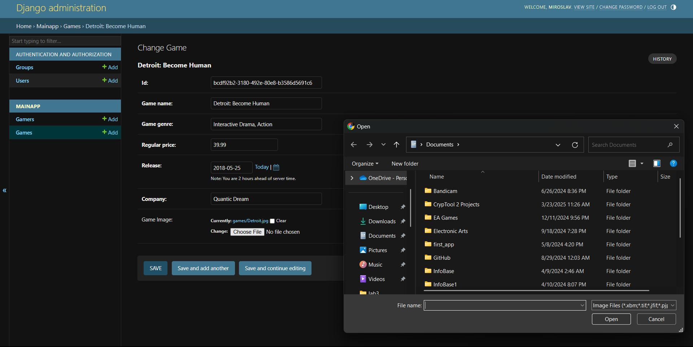

Game Web Repeatin 🎮
Game Web Repeatin is a Django-based web application that allows users to browse, purchase, and manage a catalog of video games. Admins have full control over the games, database, and user management, making it a powerful platform for both users and administrators.

Features:
User features: Browse a catalog of video games, purchase games through the web interface, view game details (images, descriptions, etc.)

Admin features: Full control over the game catalog (add, edit, delete games), manage users and their purchases, and access the admin panel to manage the entire database and system.

Tech Stack:
Python 3.x

Django 4.x

SQLite3 (for development; can be switched to PostgreSQL or MySQL)

HTML, CSS (via templates)

Bootstrap (optional)

Stripe or another payment gateway for game purchases

Here is what the application looks like:

Games in the store:

Profile:

Admin:

Getting Started:
Step 1: Clone the repository
First, clone the repository to your local machine. Open a terminal or PowerShell window, and run:

bash
Copy
Edit
git clone https://github.com/MiroCoder/game-web-repeatin.git
cd game-web-repeatin
Step 2: Create and activate a virtual environment
Next, create and activate a virtual environment. This will isolate the project dependencies from your global Python environment.

For Windows:

bash
Copy
Edit
python -m venv venv
venv\Scripts\activate
For Linux/macOS:

bash
Copy
Edit
python3 -m venv venv
source venv/bin/activate
Step 3: Install dependencies
With the virtual environment activated, install the required dependencies by running:

bash
Copy
Edit
pip install -r requirements.txt
If you don't have the requirements.txt file, you can install the necessary dependencies manually:

bash
Copy
Edit
pip install django
pip install stripe  # If you plan to use Stripe for payments
Step 4: Apply database migrations
Set up the database by running migrations. This will create the necessary tables in the database:

bash
Copy
Edit
python manage.py migrate
Step 5: Create a superuser account
To access the admin panel and manage the site, you'll need to create a superuser account. Run the following command:

bash
Copy
Edit
python manage.py createsuperuser
You’ll be prompted to enter a username, email, and password for the superuser.

Step 6: Run the development server
Now that everything is set up, start the Django development server:

bash
Copy
Edit
python manage.py runserver
The application will be accessible at http://127.0.0.1:8000 in your web browser.

Admin Panel:
Once the server is running, you can access the Django admin panel at http://127.0.0.1:8000/admin. Use the superuser credentials you created to log in and manage games, users, and other settings.

Media Files:
If you're using media files (like images for games), they will be stored in the media/ directory. Make sure to configure Django to serve these files during development. In your urls.py, ensure you have the following:

python
Copy
Edit
from django.conf import settings
from django.conf.urls.static import static

urlpatterns = [
    # Your URL patterns here...
] + static(settings.MEDIA_URL, document_root=settings.MEDIA_ROOT)
To Do:
Add advanced user features like reviews and ratings for games.

Integrate a payment gateway (e.g., Stripe or PayPal) for game purchases.

Improve the UI with Bootstrap or custom CSS.

Add search and filtering functionality for games.

Made by mirocoder